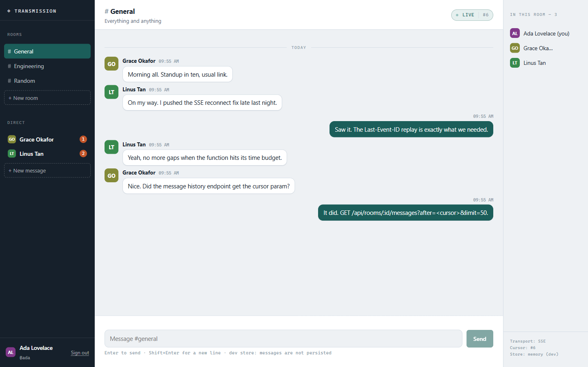
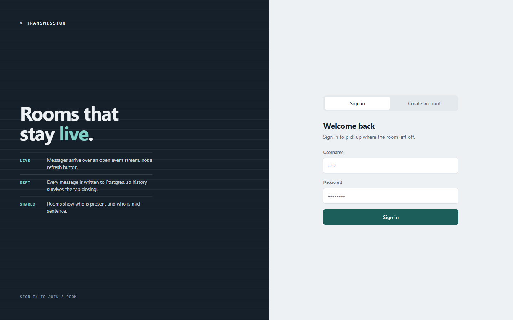
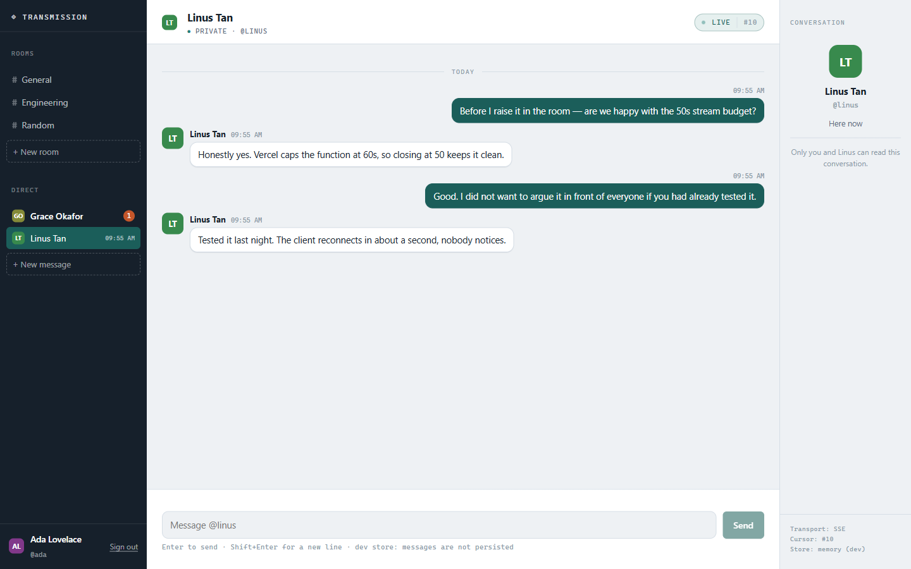
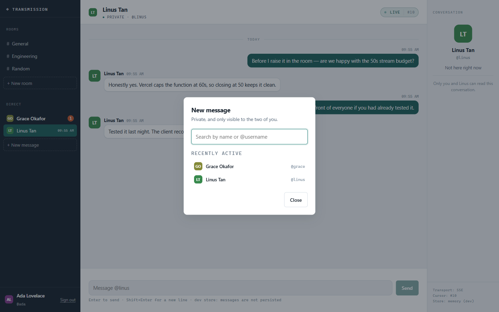
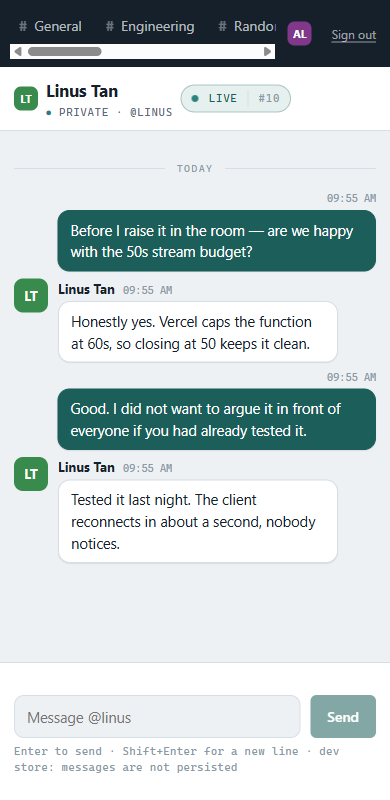

# Transmission — real-time chat

A real-time chat application: sign in, join a public room or open a private 1:1
conversation, and see messages arrive live without a refresh. History is
persisted to Postgres, so the conversation is still there tomorrow.

Built with Next.js 15 (App Router) and TypeScript, deployed on Vercel.



---

## Contents

- [What it does](#what-it-does)
- [Running it locally](#running-it-locally)
- [How real-time delivery works](#how-real-time-delivery-works)
- [HTTP API](#http-api)
- [Server-Sent Events](#server-sent-events)
- [Privacy model for direct messages](#privacy-model-for-direct-messages)
- [Data model](#data-model)
- [Concurrency](#concurrency)
- [Deploying to Vercel](#deploying-to-vercel)
- [Screenshots](#screenshots)
- [What is deliberately not built](#what-is-deliberately-not-built)

---

## What it does

- **Authentication before joining.** Username and password, hashed with scrypt.
  Sessions are HMAC-signed, `HttpOnly`, `SameSite=Lax` cookies. Every chat route
  returns 401 without one.
- **Public rooms.** Three are seeded (`#general`, `#engineering`, `#random`) and
  anyone signed in can create more.
- **Private 1:1 conversations.** Start one from the people picker, or from the
  `Message` button next to anyone in a room's roster. Only the two participants
  can read, write, stream, or even confirm the conversation exists.
- **Live delivery.** Messages reach every other participant over an open
  Server-Sent Events stream, typically within a second.
- **Persistent history.** Every message is written to Postgres and re-read on
  load, with a cursor for paging.
- **Sender distinction.** Your own messages are right-aligned in solid teal;
  everyone else's are left-aligned cards with a name and a per-user avatar
  colour. Consecutive messages from one person group together, and day markers
  break up the log.
- **Presence and typing.** The right pane lists who is in the room; the composer
  shows who is mid-sentence.
- **Unread counts.** Private conversations carry a badge, and the browser tab
  title shows the total.
- **Concurrency-safe.** Verified with 30–40 simultaneous sends across several
  users with open streams: no duplicates, no dropped messages, no 5xx.

---

## Running it locally

```bash
npm install
npm run dev
```

Then open <http://localhost:3000>.

With no `DATABASE_URL` set, the app runs against an **in-memory development
store** so it works with zero setup. It is not a substitute for the real thing:
data vanishes on restart, and on a serverless platform each instance would hold
its own private copy. The UI says `dev store: messages are not persisted` while
this mode is active.

To run against real Postgres locally, copy `.env.example` to `.env.local` and set
`DATABASE_URL`. The schema is created automatically on first request — there is
no migration step.

To fill the app with demo accounts and conversations:

```bash
node scripts/seed-demo.mjs http://localhost:3000
```

That creates `@ada`, `@linus` and `@grace` (passwords are printed), a public
conversation in `#general`, and two private conversations.

### Environment variables

| Variable | Required | Purpose |
| --- | --- | --- |
| `DATABASE_URL` | For persistence | Postgres connection string. `POSTGRES_URL` and Neon's other standard names are also accepted. |
| `AUTH_SECRET` | Recommended | HMAC key for session cookies. Generate with `node -e "console.log(require('crypto').randomBytes(32).toString('hex'))"`. If unset, a key is derived from `DATABASE_URL` so the app works the moment a database is attached — but setting it explicitly means sessions survive a database credential rotation. |
| `CHAT_STREAM_POLL_MS` | No | How often an open stream checks for new messages. Default `700`. |
| `CHAT_STREAM_TTL_MS` | No | How long one stream is held open before a clean reconnect. Default `50000`. |

---

## How real-time delivery works

Vercel runs serverless functions. There is no long-lived process to host a
WebSocket server, and two users are frequently served by two different
instances. That rules out both a socket server and an in-process event emitter —
an in-memory bus would silently drop messages between users on different
instances, which is exactly the case that matters.

So delivery works like this instead:

1. `messages.id` is a **`BIGSERIAL`** — a globally monotonic cursor.
2. A client opens an **SSE stream** for one room.
3. The stream loops server-side, querying `messages` for `id > cursor` in that
   room every `CHAT_STREAM_POLL_MS` (default 700ms) and pushing each new row to
   the browser as an event.
4. The datastore is the fan-out point, so it works no matter which instance
   serves which user.

Each stream closes itself after `CHAT_STREAM_TTL_MS` (default 50s), comfortably
inside Vercel's 60s function limit, and emits a `reconnect` frame first. The
browser's `EventSource` reopens automatically and sends the `Last-Event-ID`
header, so the new stream resumes from the exact message the old one ended on and
nothing is missed across the seam.

The trade-off is honest: delivery latency is one poll interval rather than the
sub-100ms a socket would give, and each open stream costs one query per tick. In
exchange it is correct on serverless with no broker, no extra service, and no
sticky sessions. If this ever needed true push, the change is localised to the
stream route — swapping the poll for Postgres `LISTEN/NOTIFY` or a Redis
subscription on a platform that can hold a connection.

The live status pill in the conversation header shows the transport state and
the current cursor, so the mechanism is visible rather than hidden.

---

## HTTP API

All endpoints return JSON. Errors are `{ "error": string, "field"?: string }`.
Every route except register and login requires a valid session cookie and
returns `401` without one.

### Authentication

| Method | Path | Body | Returns |
| --- | --- | --- | --- |
| `POST` | `/api/auth/register` | `{ username, password, displayName? }` | `201 { user }` and sets the session cookie. `409` if the username is taken. |
| `POST` | `/api/auth/login` | `{ username, password }` | `200 { user }` and sets the session cookie. `401` on bad credentials. |
| `POST` | `/api/auth/logout` | — | `200 { ok: true }`, clears the cookie. |
| `GET` | `/api/auth/me` | — | `200 { user }` or `401`. |

Usernames are 3–24 characters of `[a-zA-Z0-9_.-]` and are compared
case-insensitively. Passwords must be at least 8 characters. Login returns the
same error for "no such user" and "wrong password" so the endpoint cannot be used
to enumerate accounts.

### Rooms

| Method | Path | Body / Query | Returns |
| --- | --- | --- | --- |
| `GET` | `/api/rooms` | — | `200 { rooms }` — **public rooms only**. |
| `POST` | `/api/rooms` | `{ name, topic? }` | `201 { room }`. `409` if the slug is taken. |

### Messages

| Method | Path | Body / Query | Returns |
| --- | --- | --- | --- |
| `GET` | `/api/rooms/:roomId/messages` | `?after=<cursor>&limit=<1..200>` | `200 { room, messages, cursor }` |
| `POST` | `/api/rooms/:roomId/messages` | `{ body, clientNonce? }` | `201 { message }` |
| `POST` | `/api/rooms/:roomId/typing` | `{ typing: boolean }` | `200 { ok: true }` |
| `POST` | `/api/rooms/:roomId/read` | `{ lastReadId }` | `200 { ok: true }` |

`:roomId` accepts either a room id or a slug.

Without `after`, the newest page is returned in chronological order — what the UI
needs to paint history on load. With `after`, only messages newer than that
cursor are returned, ascending.

`clientNonce` makes sending **idempotent**: a retried request (double submit,
flaky network) resolves to the same stored message instead of a duplicate. It is
scoped per room, so a nonce replayed against a different room cannot read back a
message from the first one.

`typing` signals expire on their own after ~6 seconds, so a client that
disconnects mid-sentence cannot leave a stuck indicator.

`read` records how far you have read. The server applies `GREATEST()`, so an
out-of-order request can never un-read a conversation.

### Private conversations

| Method | Path | Body / Query | Returns |
| --- | --- | --- | --- |
| `GET` | `/api/conversations` | — | `200 { conversations }` — yours only, newest activity first. |
| `POST` | `/api/conversations` | `{ userId }` or `{ username }` | `200`/`201 { conversation, created }` |
| `GET` | `/api/directory` | `?q=&limit=<1..25>` | `200 { people }` |

`POST /api/conversations` is **find-or-create and idempotent** — the intent is
"open a conversation with this person", so sending it twice is a no-op rather
than a conflict. Messaging yourself returns `400`.

Each conversation carries `{ room, counterpart, lastMessage, unreadCount }`.
Message previews are truncated to 80 characters server-side.

`/api/directory` backs the people picker. With no `q` it returns recently-active
people rather than dumping the user table.

### Health

| Method | Path | Returns |
| --- | --- | --- |
| `GET` | `/api/health` | `200 { ok, store, persistent, rooms }`, or `503` if the schema bootstrap failed. |

`store` is `"postgres"` or `"memory"`. Use this to confirm a deployment actually
picked up its database.

---

## Server-Sent Events

```
GET /api/stream?roomId=<id|slug>&after=<cursor>
Accept: text/event-stream
```

Requires a session cookie, and access to the room. Returns `404 Room not found`
for a room you cannot see — including a private conversation you are not part of.

The response sets `Content-Type: text/event-stream`, `Cache-Control: no-cache,
no-store, no-transform`, and `X-Accel-Buffering: no` so proxies do not hold
frames back.

The starting cursor is taken from the `Last-Event-ID` header if present (set
automatically by the browser on reconnect), then `?after=`, then the room's
newest message id.

### Frames

| Event | Payload | Meaning |
| --- | --- | --- |
| `ready` | `{ roomId, slug, cursor, pollMs }` | Handshake. The cursor this stream starts from. |
| `message` | A full `Message` object | A new message. Carries an SSE `id:` so reconnects resume exactly here. |
| `presence` | `{ online: [...], typing: [...] }` | Who is in the room and who is typing. Sent only when it changes. |
| `reconnect` | `{ cursor }` | The server is closing cleanly. Reconnect now. |
| `error` | `{ message }` | Something failed; the client should surface it. |

Plus `: heartbeat <iso>` comment frames every 15 seconds to keep intermediaries
from treating an idle connection as dead, and a `retry: 1000` directive so the
browser reconnects in ~1s rather than its ~3s default.

A `message` payload:

```jsonc
{
  "id": "42",                          // monotonic cursor, string-encoded
  "roomId": "room_9f68…",
  "body": "Deploy is green.",
  "createdAt": "2026-09-08T04:21:56.156Z",
  "author": {
    "id": "usr_2f0a…",
    "username": "linus",
    "displayName": "Linus Tan",
    "avatarHue": 135,
    "createdAt": "2026-09-08T04:21:04.245Z"
  }
}
```

In a **public room**, `presence.online` is everyone with a presence row inside
the last 45 seconds. In a **private conversation** it is built from membership
instead, with `live` marking who is actually there — so a stray presence row can
never show a third face in a 1:1.

### Consuming it

```js
const stream = new EventSource(`/api/stream?roomId=general&after=${cursor}`);

stream.addEventListener('message', (event) => {
  render(JSON.parse(event.data));
});

stream.addEventListener('presence', (event) => {
  const { online, typing } = JSON.parse(event.data);
});

// `reconnect` is informational — EventSource reopens on its own and replays
// Last-Event-ID, so there is nothing to do but update your status indicator.
stream.addEventListener('reconnect', () => setStatus('connecting'));
```

Or from a terminal:

```bash
curl -N -b cookies.txt "http://localhost:3000/api/stream?roomId=general"
```

---

## Privacy model for direct messages

A private conversation is a room with `kind='dm'` and a two-row membership list.
That reuses the entire real-time machine — the stream, the cursor, `Last-Event-ID`
replay, idempotent sends, presence, typing — instead of forking it. The cost of
that choice is that a DM is a room whose id someone might guess, so authorization
has to be airtight.

**One rule, one place.** Every room-scoped entry point resolves the room through
`loadRoomFor(user, idOrSlug)` in [`src/lib/rooms.ts`](src/lib/rooms.ts) rather
than looking it up directly. It returns the room for a public room, the room for
a private conversation you belong to, and `null` for everything else.

Callers turn `null` into a plain `404 { "error": "Room not found" }` — **the same
response, byte for byte, as a room that does not exist**. A non-participant
cannot distinguish "not yours" from "not real", so the API is not an existence
oracle.

Applied at: `GET`/`POST /api/rooms/:id/messages`, `POST /api/rooms/:id/typing`,
`POST /api/rooms/:id/read`, and `GET /api/stream`. The stream is guarded *before*
the response stream is constructed and before any presence write, since an
unauthorized stream would be both a live firehose and a way to seat an intruder
in the participants' roster.

Supporting decisions:

- `GET /api/rooms` filters `kind='public'` **inside the store method**, not in
  the route, so a future caller cannot forget it and turn the room list into an
  index of everyone's private conversations.
- DM rooms are stored with an empty `name` and `topic`, so even a leaked row
  identifies nobody.
- DM slugs are **random**, not derived from the participants. A derived slug
  would let anyone who knows two user ids probe for their conversation.
- `GET /api/conversations` is scoped by construction — it starts from your
  membership rows and takes no room id from the request.
- The tab title shows a count, never a name.

**What this is not:** messages are stored in plaintext and are readable by anyone
with database access. "Private" here means *no other user of this app can read
it* — not end-to-end encryption.

Verified by test: a signed-in non-member hitting the DM by room id, by slug,
posting, typing, marking read, and opening the stream all return `404` with a
body identical to a nonexistent room, and the DM appears in neither their room
list nor their conversation list.

---

## Data model

```
users          id, username, username_lower (unique), display_name,
               password_hash, avatar_hue, created_at

rooms          id, slug (unique), name, topic, created_at, created_by,
               kind ('public' | 'dm'), dm_key
               └── unique index on dm_key WHERE dm_key IS NOT NULL

room_members   room_id, user_id, joined_at, last_read_id
               └── PK (room_id, user_id)

messages       id BIGSERIAL, room_id, user_id, body, client_nonce, created_at
               ├── index (room_id, id)              — the stream's tail query
               └── unique (user_id, client_nonce)   — idempotent sends

presence       room_id, user_id, last_seen_at
typing_state   room_id, user_id, expires_at
```

The schema is applied at runtime by `ensureSchema()` in
[`src/lib/db.ts`](src/lib/db.ts) — idempotent `CREATE TABLE IF NOT EXISTS` and
`ADD COLUMN IF NOT EXISTS`, serialised by a transaction-scoped advisory lock so
competing cold starts cannot race inside the system catalogs. Every change is
additive, so it applies safely to a database that already holds data.

`room_members` is authoritative for access **only when `kind='dm'`**. For public
rooms a row exists purely to hold `last_read_id`; authorization never consults
it there.

`dm_key` is the canonical identity of a 1:1 conversation: the two user ids,
sorted, joined with `|`. Sorting makes it symmetric, and the unique index makes a
duplicate thread **structurally impossible** rather than merely unlikely — two
people starting a conversation at the same instant on two different instances hit
a `23505`, and the loser re-reads the winner's room. Verified with 12 concurrent
creations from both sides: exactly one room.

Storage sits behind one `ChatStore` interface with two implementations —
`PostgresStore` and an in-memory `MemoryStore` for local development — so the app
runs with or without a database.

---

## Concurrency

The requirement was no server errors under basic concurrency. What was actually
tested against a running server:

| Test | Result |
| --- | --- |
| 40 simultaneous sends, 2 users, 6 open streams | 40 × `201`, all persisted, 0 errors |
| 30 simultaneous sends after the private-chat change | 30 × `201`, 0 errors |
| 12 simultaneous DM creations for the same pair | exactly 1 room |
| Same `clientNonce` sent twice | same message id, no duplicate row |
| Nonce replayed into a different room | new message, no cross-room leak |

Supporting details: the `pg` pool is capped and cached per instance with an
`error` handler so an idle client dropping cannot take the process down; schema
bootstrap is advisory-locked; a failed bootstrap is not cached, so the next
request retries.

---

## Deploying to Vercel

1. Push to GitHub and import the repository at
   [vercel.com/new](https://vercel.com/new). Framework detection handles the
   build; no configuration needed.
2. **Attach Postgres.** In the Vercel dashboard: **Storage → Create Database →
   Neon (Postgres)**, then connect it to the project. That injects
   `DATABASE_URL` automatically and triggers a redeploy. The schema is created on
   the first request after that.
3. **Set `AUTH_SECRET`** under Settings → Environment Variables:
   ```bash
   node -e "console.log(require('crypto').randomBytes(32).toString('hex'))"
   ```
4. Confirm with `GET /api/health` — it should report
   `{"ok":true,"store":"postgres","persistent":true}`.

Until step 2, the deployment runs on the in-memory store: it will load and you
can sign in, but messages will not persist and two users on different instances
will not see each other.

`maxDuration` on the stream route is 60s, within the Hobby plan's limit. Each
open chat tab holds one streaming function invocation.

---

## Screenshots

| | |
| --- | --- |
| **Sign in** — accounts are required before joining any room.<br> | **Public room** — rooms and private conversations in one rail, unread badges on DMs, live cursor in the header.<br> |
| **Private conversation** — counterpart card replaces the roster, composer says `Message @linus`.<br> | **People picker** — start a private chat by name or `@username`.<br> |



Reproduce these: `node scripts/seed-demo.mjs http://localhost:3000`, then sign in
as `@ada` / `analytical-engine`.

---

## What is deliberately not built

Named so the gaps are choices rather than surprises:

- **No group DMs.** `room_members` is already N-ary; only `dm_key` assumes two
  people.
- **No block or mute.** Anyone signed in can start a conversation with anyone
  else. That matches the app's flat trust model, and is the first thing to
  revisit for a larger population.
- **No push notifications or sound.** The tab title count and the rail badge
  cover the honest 90% without a service worker and a permission prompt.
- **No message editing, deletion, reactions, or attachments.**
- **No infinite scroll.** The history endpoint takes a cursor and the API
  supports it; the UI currently loads the newest 50.
- **A new DM from someone else takes up to ~8s to appear** in your rail, since
  the SSE stream is scoped to the open room and the conversation list is polled.
  Opening it is instant; only the rail entry waits.
- **Traffic metadata is inferable.** Because `messages.id` is global, someone
  watching the cursor in a public room can tell that private messages are being
  sent somewhere — never by whom or what. Removing that would mean giving up the
  cursor the whole real-time layer depends on.
