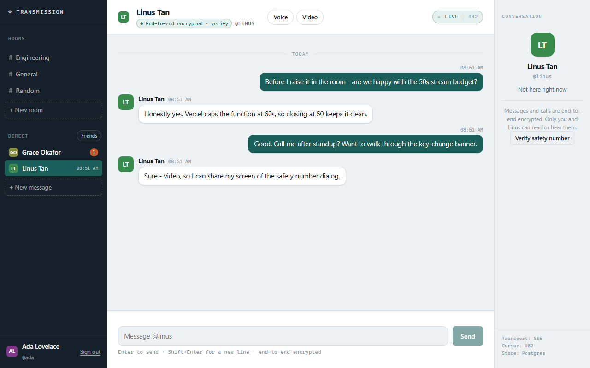
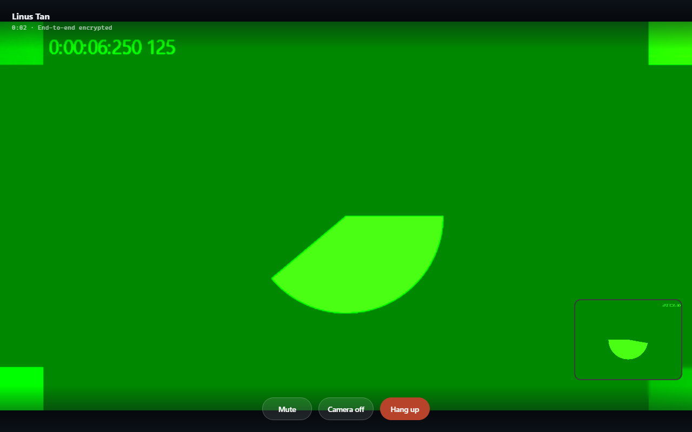
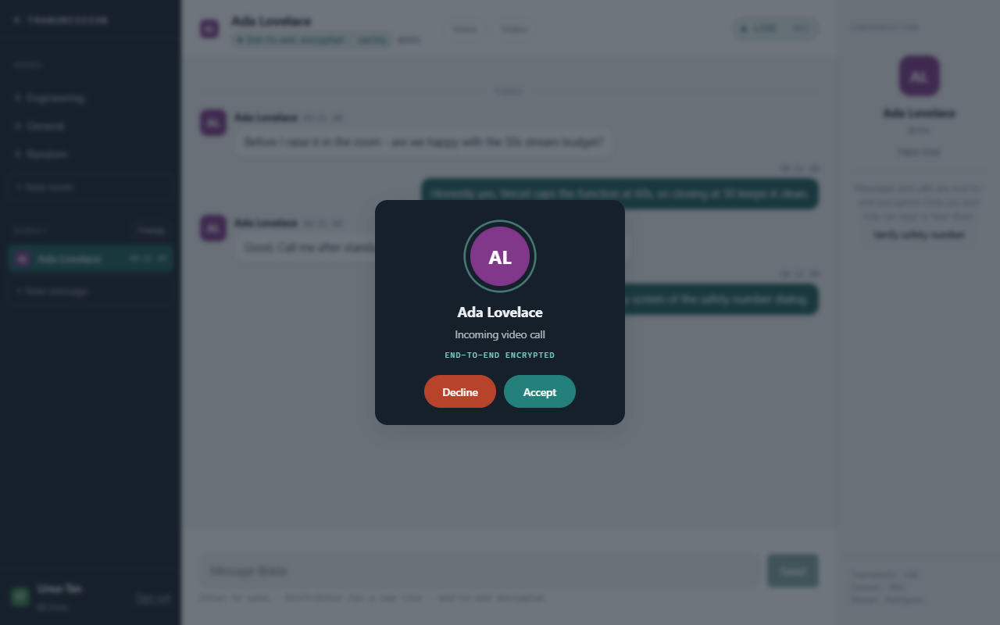
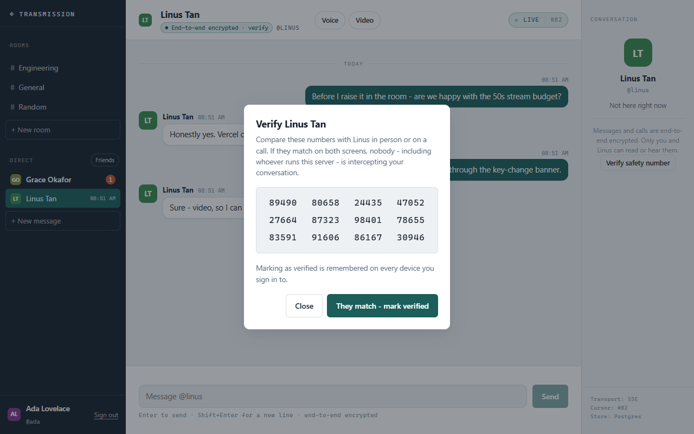
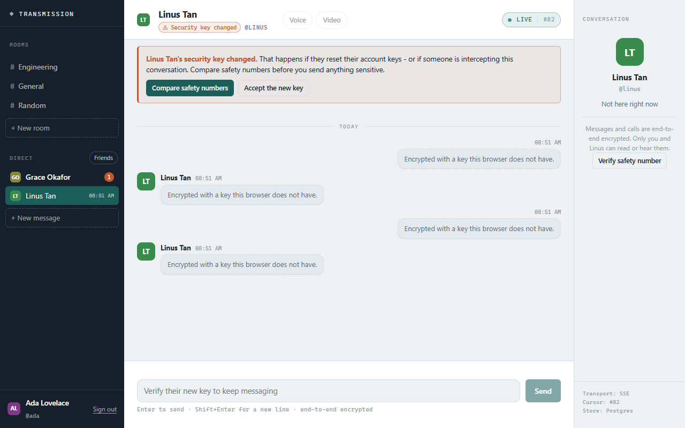
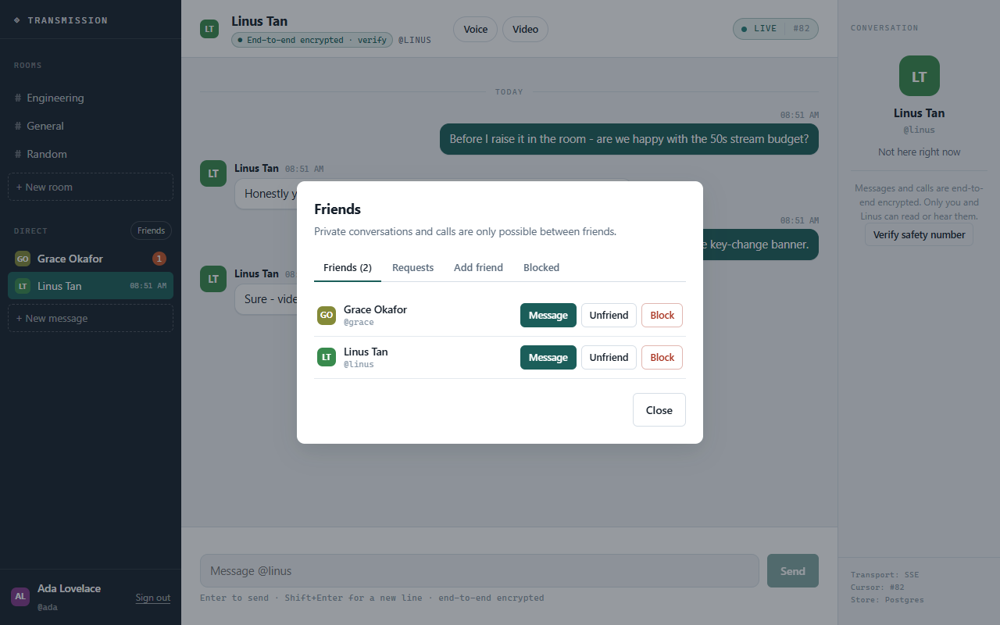
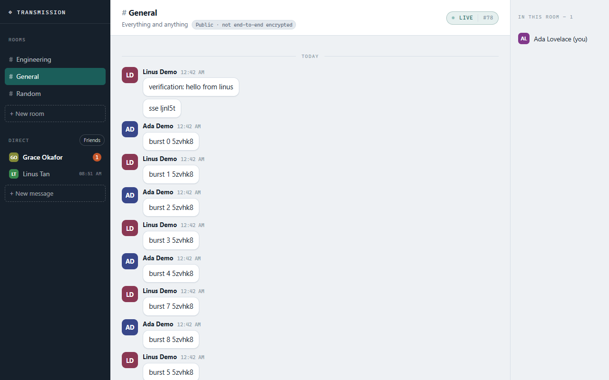
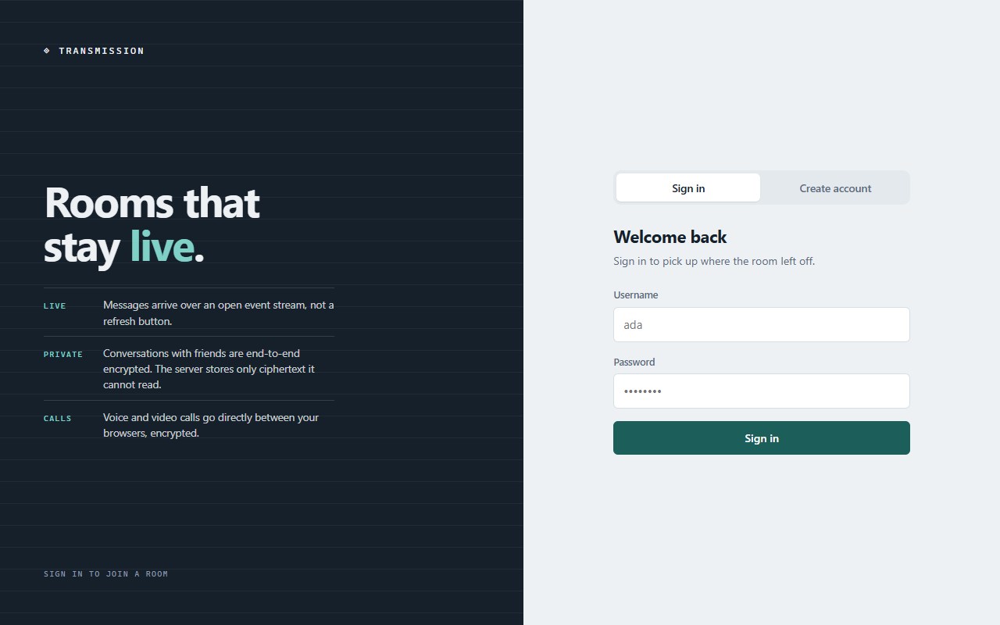
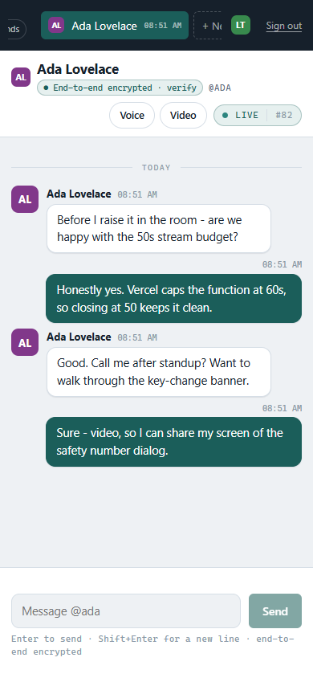

# Transmission — real-time chat

A real-time chat application: sign in, join a public room, add friends, and talk
to them in private conversations that are **end-to-end encrypted** — including
**voice and video calls**. Messages arrive live without a refresh, and history
is persisted to Postgres.

Built with Next.js 15 (App Router) and TypeScript, deployed on Vercel.

**Live:** https://realtime-chat-app-n-green-ve.vercel.app



> **On encryption:** private conversations and calls are end-to-end encrypted —
> the server stores only ciphertext it cannot read, and never receives your
> password. There are honest limits, the biggest being that the server delivers
> the app's JavaScript. They are spelled out in
> **[docs/ENCRYPTION.md](docs/ENCRYPTION.md)**; please read that before relying
> on it for anything that matters.

---

## Contents

- [What it does](#what-it-does)
- [Running it locally](#running-it-locally)
- [Testing](#testing)
- [How real-time delivery works](#how-real-time-delivery-works)
- [HTTP API](#http-api)
- [Server-Sent Events](#server-sent-events)
- [Privacy and access control](#privacy-and-access-control)
- [Verified behaviour](#verified-behaviour)
- [Data model](#data-model)
- [Deploying](#deploying)
- [Screenshots](#screenshots)
- [What is deliberately not built](#what-is-deliberately-not-built)

---

## What it does

- **Authentication before joining.** Your password never leaves the browser: it
  is stretched (PBKDF2, 600,000 iterations) into a secret that is sent instead,
  and a separate key that stays in the browser and unlocks your encryption keys.
  Sessions are HMAC-signed `HttpOnly` cookies that the server can revoke.
- **Public rooms.** Three are seeded (`#general`, `#engineering`, `#random`), and
  anyone signed in can create more. Clearly labelled *not end-to-end encrypted*.
- **Friends.** Add people by exact username, accept or decline requests, unfriend,
  and block. Requests appear live, with a badge and a tab-title count.
- **End-to-end encrypted private conversations** between friends. Messages are
  encrypted in the sender's browser and decrypted in the recipient's; the server
  stores ciphertext. See [docs/ENCRYPTION.md](docs/ENCRYPTION.md).
- **Key verification.** Compare a 60-digit safety number with a friend. If the
  server ever swaps someone's key, the conversation locks behind a warning.
- **Voice and video calls** between friends, over WebRTC. Media flows directly
  between browsers, encrypted; the server relays only call setup, and even that
  is sealed so it cannot read your IP address or intercept the call.
- **Blocking.** A blocked person's view of your conversation disappears entirely
  — history, live updates, typing, calls — indistinguishable from it never
  having existed. They are not told.
- **Live delivery.** Server-Sent Events, typically within a second.
- **Persistent history** in Postgres, with a cursor for paging.
- **Sender distinction.** Your messages are right-aligned in solid teal; others
  are left-aligned cards with a name and a per-user avatar colour. Consecutive
  messages group, and day markers break up the log.
- **Presence, typing, unread counts.**
- **Concurrency-safe.** Races are resolved by the database, not by hoping — see
  [Verified behaviour](#verified-behaviour).

---

## Running it locally

```bash
npm install
npm run dev
```

Then open <http://localhost:3000>.

With no `DATABASE_URL`, the app runs against an **in-memory development store**
so it works with zero setup — including friends, encryption and calls. Data
vanishes on restart, and on a serverless platform each instance would hold its
own copy, so never deploy it that way. The composer says `dev store: messages
are not persisted` while this is active.

For real Postgres, copy `.env.example` to `.env.local` and set `DATABASE_URL`.
The schema is created automatically on first request; there is no migration
step, and every schema change is additive, so it upgrades an existing database
in place.

Demo accounts, friendships and encrypted conversations:

```bash
npm run seed -- http://localhost:3000
```

That creates `@ada`, `@linus` and `@grace` (passwords are printed), makes them
friends, and seeds `#general` plus two end-to-end encrypted conversations.

### Environment variables

| Variable | Required | Purpose |
| --- | --- | --- |
| `DATABASE_URL` | For persistence | Postgres connection string. Neon's `STORAGE_URL`, `POSTGRES_URL` and similar are also found automatically — whatever prefix you chose when connecting the database. |
| `AUTH_SECRET` | Recommended | HMAC key for session cookies. Generate with `node -e "console.log(require('crypto').randomBytes(32).toString('hex'))"`. If unset, one is derived from the database URL, and `/api/health` reports `"sessionKey": "derived"`. |
| `CHAT_TURN_URLS` | For calls on strict networks | Comma-separated TURN server URLs. See [Calls and TURN](#calls-and-turn). |
| `CHAT_TURN_SECRET` | With the above | coturn `use-auth-secret`: short-lived HMAC credentials per user. |
| `CHAT_TURN_USERNAME` / `CHAT_TURN_CREDENTIAL` | Alternative | Static credentials, for providers that issue them. |
| `CHAT_LEGACY_AUTH_UNTIL` | No | ISO date after which accounts created before encryption can no longer be upgraded. Default `2026-11-15`. |
| `CHAT_STREAM_POLL_MS` | No | How often an open stream checks for new rows. Default `700`. |
| `CHAT_STREAM_TTL_MS` | No | How long one stream is held before a clean reconnect. Default `50000`. |

---

## Testing

```bash
npm run typecheck
npm run test:crypto                       # 24 tests of the encryption primitives
npm run verify -- http://localhost:3000   # 83 end-to-end checks over the HTTP API
npm run test:calls -- http://localhost:3000   # real video call between two Chromes
```

- **`test:crypto`** runs the real Web Crypto code under Node. Most of the 24
  tests try to *break* it: moved, re-attributed and replayed ciphertext, a
  flipped byte, a third party's keys, a call signal served as a chat message,
  IV reuse, and that the secret the server receives cannot open the vault. Runs
  in CI on every push.
- **`verify`** registers fresh accounts and drives auth, friends (including the
  races), encrypted messaging, access control, live delivery, calls, blocking
  and concurrency. It derives keys with the app's own `crypto.ts`, exactly as a
  browser would. Set `LEGACY_ACCOUNT="username:password"` to also rehearse
  upgrading an account created before encryption.
- **`test:calls`** needs `npm run seed` first. It launches two isolated Chrome
  instances with Chrome's **fake camera and microphone** (a green test pattern
  and a tone), places a video call through the real UI, and asserts live video
  and audio arrive on both sides, mute propagates, and hang-up ends the call.
  With `DATABASE_URL` set it also inspects the database to prove every stored
  signalling message was unreadable. Uses the installed Chrome (`CHROME_PATH`
  to override).

---

## How real-time delivery works

Vercel runs serverless functions: there is no long-lived process for a WebSocket
server, and two users are usually served by different instances. An in-process
event bus would silently drop messages between them — exactly the case that
matters.

So the **database is the fan-out point**:

1. `messages.id` is a `BIGSERIAL` — a globally monotonic cursor.
2. A client opens a Server-Sent Events stream for the room on screen.
3. The stream queries for `id > cursor` every `CHAT_STREAM_POLL_MS` and pushes
   each new row.

Each stream closes itself after `CHAT_STREAM_TTL_MS` (50s, inside Vercel's 60s
limit) with a `reconnect` frame. The browser's `EventSource` reopens
automatically and sends `Last-Event-ID`, so the new stream resumes exactly where
the old one ended.

A second, **user-scoped stream** stays open whichever room is showing. It
carries what is addressed to *you* rather than to a room: an incoming call
ringing, WebRTC signalling for a call you are in, and changes to your friend
requests. That is how a call rings, or a request badge appears, while you are
reading something else.

The trade-off is honest: latency is one poll interval rather than a socket's
sub-100ms, and each open stream costs a query per tick. In exchange it is
correct on serverless with no broker. The status pill in the header shows the
transport and live cursor.

---

## HTTP API

JSON throughout. Errors are `{ "error": string, "field"?: string }`. Everything
except register and login requires a session cookie and returns `401` without.

### Authentication

| Method | Path | Body | Returns |
| --- | --- | --- | --- |
| `POST` | `/api/auth/register` | `{ username, displayName?, authSecret, vaultId, identityPub, vault: {ct, iv} }` | `201 { user, keys }` + session cookie. `409` if the username is taken. |
| `POST` | `/api/auth/login` | `{ username, authSecret }` | `200 { user, keys }` + session cookie. `401` otherwise. |
| `POST` | `/api/auth/login` | `{ username, password, upgrade: {...} }` | One-time upgrade of an account created before encryption. Refused for an upgraded account. |
| `POST` | `/api/auth/logout` | — | Clears the cookie. |
| `GET` | `/api/auth/me` | — | `200 { user }` or `401`. |

`authSecret` is 64 hex characters derived from the password in the browser; the
raw password is refused. `keys` is your sealed vault, which only your password
can open. Failed sign-ins take the same time whether or not the account exists.
Rate-limited per IP and per username.

### Keys

| Method | Path | Returns |
| --- | --- | --- |
| `GET` | `/api/keys/me` | Your sealed vault — for a browser that has a session but lost its keys. |
| `GET` | `/api/keys/:userId` | `{ userId, identityPub }`. Deliberately no server-computed fingerprint. |
| `POST` | `/api/keys/vault` | `{ vault: {ct, iv}, version }` — re-sealed vault. Must be exactly the next version; `409` on conflict. |

### Friends and blocks

| Method | Path | Body | Returns |
| --- | --- | --- | --- |
| `GET` | `/api/friends` | — | `{ friends, incoming, outgoing }` |
| `POST` | `/api/friends/requests` | `{ username }` or `{ userId }` | `201` pending, or `200` accepted if they had already asked you. `409` already sent, `429` too soon after a decline. |
| `POST` | `/api/friends/requests/:userId/accept` | — | `200`. `404` if there is no request *to you* from them. |
| `POST` | `/api/friends/requests/:userId/decline` | — | `204`. They are not told. |
| `DELETE` | `/api/friends/requests/:userId` | — | `204` — withdraw your request. |
| `DELETE` | `/api/friends/:userId` | — | `204` — unfriend. |
| `GET` | `/api/blocks` | — | People *you* blocked. Never who blocked you. |
| `POST` | `/api/blocks` | `{ userId }` | `204`. Removes any friendship. |
| `DELETE` | `/api/blocks/:userId` | — | `204`. Returns you to strangers, not friends. |
| `GET` | `/api/directory` | `?q=` | Your friends and requests, plus at most one stranger on an **exact** username match. |

Unknown users and blocked users get the same `404 No such person`, so the API
cannot reveal who has blocked you.

### Rooms and messages

| Method | Path | Body / Query | Returns |
| --- | --- | --- | --- |
| `GET` | `/api/rooms` | — | Public rooms only. |
| `POST` | `/api/rooms` | `{ name, topic? }` | `201 { room }` |
| `GET` | `/api/rooms/:roomId/messages` | `?after=&limit=` | `{ room, messages, cursor }` |
| `POST` | `/api/rooms/:roomId/messages` | see below | `201 { message }` |
| `POST` | `/api/rooms/:roomId/typing` | `{ typing }` | `{ ok: true }` |
| `POST` | `/api/rooms/:roomId/read` | `{ lastReadId }` | `{ ok: true }` |

A message is sent as plaintext `{ body, clientNonce? }` in a public room, and as
ciphertext in a private one:

```jsonc
{
  "encVersion": 1,
  "body": "bMs0y0RrRSFY…",   // base64url AES-GCM ciphertext — the server cannot read it
  "iv": "xljJLpEl-9mhQIse",
  "epoch": "141ca57f",
  "clientNonce": "k3J…"      // required: it is part of the ciphertext's authenticated data
}
```

Once a private room has carried an encrypted message, plaintext into it is
refused (`409`). Ciphertext into a public room is refused (`400`). `clientNonce`
makes sends idempotent.

### Private conversations

| Method | Path | Body | Returns |
| --- | --- | --- | --- |
| `GET` | `/api/conversations` | — | Yours, newest first, each with the other person's public key. |
| `POST` | `/api/conversations` | `{ userId }` or `{ username }` | Find-or-create. Starting a **new** one needs an accepted friendship (`403` otherwise); existing conversations stay openable. |

### Calls

| Method | Path | Body | Returns |
| --- | --- | --- | --- |
| `POST` | `/api/rooms/:roomId/calls` | `{ media: 'audio'\|'video', clientNonce }` | `201 { call }`. Friends only. `409 {reason:'busy'}`, or `409 {reason:'glare', callId}` if they are calling you. |
| `GET` | `/api/rooms/:roomId/calls` | `?limit=` | Call history. |
| `POST` | `/api/calls/:callId/signal` | `{ kind, sigNonce, iv, payload }` | `202`. `payload` is sealed; the server never parses it. |
| `POST` | `/api/calls/:callId/state` | `{ action }` | `accept`/`decline` (callee), `cancel`/`missed` (caller), `end`/`fail` (either). Illegal transitions return `409` with the real state. |
| `POST` | `/api/calls/:callId/heartbeat` | — | `204` every 15s while connected. |
| `GET` | `/api/ice` | — | `{ iceServers, relay }` |

### Health

`GET /api/health` → `{ ok, store: "postgres"|"memory", persistent, rooms, sessionKey }`,
or `503` if the schema bootstrap failed.

---

## Server-Sent Events

### Room stream

```
GET /api/stream?roomId=<id|slug>&after=<cursor>
```

| Event | Payload | Meaning |
| --- | --- | --- |
| `ready` | `{ roomId, slug, cursor, pollMs }` | Handshake. |
| `message` | A `Message` (ciphertext in private rooms) | Carries `id:` so reconnects resume exactly here. |
| `presence` | `{ online, typing }` | Sent only when it changes. |
| `reconnect` | `{ cursor }` | Closing cleanly; reconnect now. |
| `error` | `{ message }` | Surface it. |

### User stream

```
GET /api/stream?scope=user
```

| Event | Payload | Meaning |
| --- | --- | --- |
| `ready` | `{ scope, cursor, pollMs }` | Handshake. |
| `call` | A `Call` | An incoming call ringing, or a call you are in changing state. |
| `signal` | A sealed `CallSignal` | WebRTC signalling for your call. Carries `id:` for resume. |
| `social` | `{ incoming, rev }` | Your friend requests or friends changed; refetch `/api/friends`. |

Both streams send `: heartbeat` comments every 15s and `retry: 1000`.

```js
const room = new EventSource(`/api/stream?roomId=general&after=${cursor}`);
room.addEventListener('message', (e) => render(JSON.parse(e.data)));

const me = new EventSource('/api/stream?scope=user');
me.addEventListener('call', (e) => maybeRing(JSON.parse(e.data)));
```

---

## Privacy and access control

**One rule, one place.** Every room-scoped route resolves the room through
`loadRoomFor(user, id)` in [`src/lib/rooms.ts`](src/lib/rooms.ts). It returns a
public room, a private conversation you belong to (and have not been blocked
from), and `null` for everything else. Routes turn `null` into `404 Room not
found` — **byte-identical to a room that does not exist** — so the API cannot be
used to discover that a conversation exists.

Applied to messages, typing, read receipts, both streams, and calls. The stream
is checked before any response is constructed or any presence is written.

**End-to-end encryption** protects the *content* even from the server itself;
access control keeps other *users* out. The full model, including what it does
not protect against, is in [docs/ENCRYPTION.md](docs/ENCRYPTION.md).

Also:

- `GET /api/rooms` filters to public rooms inside the store, so no future caller
  can list private ones.
- Private rooms have no name or topic, and random slugs.
- The directory has no prefix search over strangers and no "recently active"
  list — the first made the user table harvestable, the second told anyone who
  was online right now.
- The tab title shows counts, never names.

---

## Verified behaviour

Against a production build with a real Postgres 18 — and again on the live Vercel deployment against Neon. `npm run verify` — **83/83** (89/89 with `LEGACY_ACCOUNT` set):

| Area | What was proven |
| --- | --- |
| Auth | Raw passwords refused; a fresh "device" opens the same identity from the vault using only the password; wrong password `401` and not mistaken for a legacy account |
| Legacy upgrade | A genuine pre-encryption account upgrades once, is refused the raw password afterwards, and signs in the new way |
| Friends | Simultaneous mutual requests converge on friends; a double accept has exactly one winner; decline cooldown; exact-username lookup finds strangers, partial names do not |
| Encryption | The server stores ciphertext; the recipient decrypts it; plaintext refused once encrypted; ciphertext refused in public rooms; rail previews keep the whole ciphertext |
| Access control | A non-member's history, post, typing, call and stream requests all `404`, identical to a nonexistent room |
| Calls | Callee rung live; the server never saw the SDP; glare and busy handled; caller cannot answer their own call; both hanging up at once has exactly one winner; signalling refused after hang-up |
| Blocking | Blocked user gets `404` everywhere and cannot tell; blocker keeps their history but cannot send; unblock returns to strangers |
| Concurrency | 20 simultaneous encrypted sends from two users: all accepted, all decrypt, no `5xx` |

`npm run test:calls` — **13/13**: a real video call between two Chrome
instances; both receive live video and audio; **21 signalling messages stored,
0 readable**; mute propagates; hang-up ends it and the signalling is deleted.
Against the live Vercel deployment it also passes (8/8 — the five database
checks need direct database access): signalling through serverless functions
and Neon, live video and audio both ways. Both browsers ran on one machine, so
this does not prove NAT traversal between different networks.

By hand, in a browser:

- After sending *"Meet at the observatory at nine"*, the database row held 466
  characters of ciphertext, and the word "observatory" appeared **nowhere** in
  the database.
- Swapping a friend's public key directly in the database — simulating a
  malicious operator — locked the conversation behind a **security key changed**
  warning, disabled sending and calls, and cleared when the real key came back.
- Both users saw identical 60-digit safety numbers.

---

## Data model

```
users          id, username, username_lower (unique), display_name,
               password_hash, avatar_hue, auth_version, token_version

user_keys      user_id, vault_id, identity_pub, vault_ct, vault_iv, vault_version
               — the sealed vault; nothing here is readable by the server

rooms          id, slug, name, topic, kind ('public'|'dm'), dm_key (unique),
               e2ee_since_id
room_members   room_id, user_id, last_read_id

messages       id BIGSERIAL, room_id, user_id, body, client_nonce,
               enc_version, enc_iv, enc_epoch
               └── unique (user_id, client_nonce) — idempotent sends

friendships    low_user_id, high_user_id, status, requested_by
               └── PK (low, high), CHECK low < high — one row per pair
user_blocks    blocker_id, blocked_id

calls          id, room_id, caller_id, callee_id, media, state, last_seen_at
call_signals   id BIGSERIAL, call_id, from_user, to_user, kind, payload (sealed)

presence, typing_state, rate_limits
```

The schema is applied at runtime by `ensureSchema()` in
[`src/lib/db.ts`](src/lib/db.ts): idempotent, additive, and serialised by an
advisory lock so racing cold starts cannot collide. Upgrading an existing
database backfills a friendship for every conversation that already existed, so
nobody is locked out by a rule added later.

Each schema version is recorded in `schema_migrations` once applied, so an
ordinary cold start runs one indexed `SELECT` and no DDL. This matters on
serverless: `ALTER TABLE … IF NOT EXISTS` takes an exclusive table lock even
when there is nothing to change, and running it on every cold start deadlocked
against live message inserts under load. A migration that is needed runs with a
short `lock_timeout`, so if it collides with live traffic it is the one that
backs off and retries. Separately, statements and transactions that Postgres
aborts as a deadlock or serialization failure are retried automatically.

Races are settled by the database rather than application code:

- **One friendship per pair** — the pair is stored sorted, so `(A,B)` and
  `(B,A)` collide on the primary key; two people requesting each other at once
  resolve to friends inside a single `INSERT … ON CONFLICT`.
- **One conversation per pair** — a unique index on `dm_key`.
- **Call states** — each transition is one conditional `UPDATE` encoding the
  legal previous state and who may make it.

---

## Deploying

This is a Node server with API routes, long-lived streams and Postgres, so
static hosts such as GitHub Pages cannot run it.

### Vercel

1. Import the repository at [vercel.com/new](https://vercel.com/new).
2. **Storage → Create Database → Neon (Postgres)** and connect it to the project.
   Any variable prefix works.
3. Set **`AUTH_SECRET`** under Settings → Environment Variables.
4. **Settings → Deployment Protection**: turn off Vercel Authentication if the URL
   should be shareable.
5. Check `GET /api/health` reports `"store":"postgres"`, then run
   `npm run verify -- <url>`.

### Render

`render.yaml` is a blueprint: **New → Blueprint**, pointed at this repository,
creates the web service and a Postgres together and generates `AUTH_SECRET`.

### Calls and TURN

Calls try a direct connection first, using public STUN servers. That works on
most home and mobile networks. Behind symmetric NAT or a strict corporate or
campus firewall a direct connection is impossible and a **TURN relay** is
needed. Without one, those calls fail — every time, with a message that says a
relay is missing, rather than hanging.

To enable one, set `CHAT_TURN_URLS` plus either `CHAT_TURN_SECRET` (a self-hosted
coturn with `use-auth-secret`) or `CHAT_TURN_USERNAME`/`CHAT_TURN_CREDENTIAL`
(a hosted provider). A relay forwards the media but cannot read it: it stays
DTLS-SRTP encrypted between the two browsers.

---

## Screenshots

| | |
| --- | --- |
| **End-to-end encrypted conversation** — the header chip opens verification; voice and video between friends.<br> | **Video call** — direct between browsers, encrypted. (Chrome's built-in fake camera, used by the automated test, shows the green pattern.)<br> |
| **Incoming call** — rings live over the user stream, whatever room is open.<br> | **Safety number** — computed in each browser; identical digits mean nobody is in the middle.<br> |
| **A swapped key is caught** — messaging and calls lock until you verify.<br> | **Friends** — add by exact username, requests, blocking.<br> |
| **Public room** — labelled not end-to-end encrypted.<br> | **Sign in** — the password is stretched in the browser and never sent.<br> |



Reproduce them with `npm run seed`, then sign in as `@ada` (the seed prints the passwords).

---

## What is deliberately not built

- **No forward secrecy, no key rotation, no multi-device key management.** One
  long-term key per person. See [docs/ENCRYPTION.md](docs/ENCRYPTION.md).
- **No password reset or recovery code.** Forgetting your password loses your
  encrypted history. The schema has room for a recovery code; the flow is not
  built.
- **No group end-to-end encryption.** Public rooms are plaintext and say so;
  private conversations are 1:1.
- **No TURN relay configured** on the live deployment — see [Calls and
  TURN](#calls-and-turn).
- **No nonce-based script Content Security Policy** yet; framing is blocked.
- **No push notifications.** A call rings only while the app is open in a tab;
  otherwise it shows as missed.
- **No message editing, deletion, reactions or attachments; no infinite
  scroll** (the API takes a cursor; the UI loads the newest 50).
- **Metadata is visible to the server** — who talks to whom and when.
